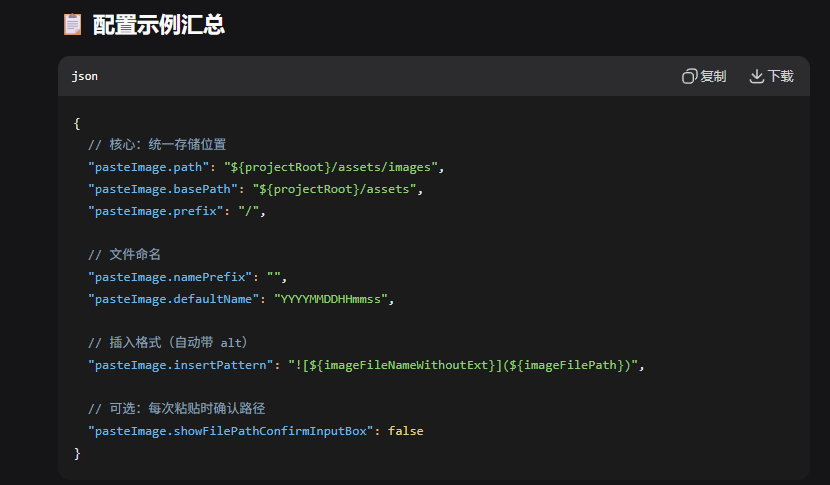

# 大数据开发工程师 · 系统学习大纲

> 面向数仓清洗岗位，结合座舱大数据 / 多模态 / MCP·Agent 方向，为面试与应聘做系统化准备。

---

## 一、需要熟练掌握（面试必考、日常必用）

### 1. 编程与数据工程

| 模块 | 内容要点 | 建议掌握程度 |
|------|----------|--------------|
| **Python** | 数据结构、函数式/面向对象、异常与日志、多线程/多进程基础；Pandas/NumPy 做数据清洗与特征；与 Spark/Flink 的 API 结合使用 | 能独立完成 ETL 脚本、数据清洗、简单特征工程 |
| **SQL** | 多表 JOIN（INNER/LEFT）、子查询、窗口函数、聚合与分组、分区表查询与动态分区、INSERT OVERWRITE/INSERT INTO；HiveQL/Spark SQL 语法差异 | 能写复杂清洗 SQL、优化慢查询、遵守分区与命名规范 |
| **Spark** | RDD/DataFrame API、宽窄依赖与 Stage、Shuffle 与分区策略、AQE/动态分区合并；Spark SQL 执行计划与调优（广播、倾斜处理） | 能设计离线清洗任务、定位性能瓶颈、控制小文件与倾斜 |
| **Flink** | 流批一体概念、DataStream/Table API、状态与 checkpoint、水位线、窗口（滚动/滑动/会话）；与 Kafka 的 Source/Sink | 能搭建实时管道、处理乱序与迟到数据、做简单背压与资源调优 |

### 2. 数据仓库与建模

| 模块 | 内容要点 | 建议掌握程度 |
|------|----------|--------------|
| **数仓分层** | ODS → DWD → DWS → ADS 的含义与职责；主题域划分、一致性维度与事实表 | 能说清每层输入输出与清洗边界 |
| **建模方法** | 维度建模（星型/雪花）、事实表类型（事务/周期快照/累积快照）、缓慢变化维（SCD） | 能参与设计或评审表结构、区分事实与维度 |
| **数据清洗规范** | 空值/异常值处理、去重策略、数据质量校验（完整性、一致性、及时性）；与 SQL 静态检查规则的对应（分区、JOIN、类型转换等） | 能制定清洗规则并在代码中落地 |

### 3. 数据管道与调度

| 模块 | 内容要点 | 建议掌握程度 |
|------|----------|--------------|
| **离线管道** | 全量/增量抽取、拉链表、分区覆盖与回溯；任务依赖与重跑策略 | 能设计并实现可回溯、可重跑的离线任务 |
| **实时管道** | 消息队列（Kafka）消费、Exactly-Once 语义、迟到数据处理；与 Flink 的集成 | 能说明实时链路架构并实现简单实时清洗 |
| **调度与运维** | 使用 Airflow/DolphinScheduler 等编排 DAG、监控告警、失败重试与数据对账思路 | 能配置调度任务并做基本运维 |

---

## 二、需要熟悉（能讲清原理、能参与设计与协作）

### 1. 多模态数据与特征工程

| 模块 | 内容要点 | 建议熟悉程度 |
|------|----------|--------------|
| **多模态数据类型** | 视觉（车内摄像头图像/视频）、语音、文本、车辆时序（CAN/传感器）；存储格式与采样频率 | 能区分数据源、说明清洗与采样策略 |
| **特征提取与标注** | 与算法协作：情绪、手势等标注规范；特征表设计、标注数据版本管理 | 能理解标注流程、参与特征表设计 |
| **数据质量与标注质量** | 标注一致性、噪声处理、样本平衡；与数据清洗的衔接 | 能参与质量评估与问题排查 |

### 2. 大模型与数据服务

| 模块 | 内容要点 | 建议熟悉程度 |
|------|----------|--------------|
| **大模型基础** | 预训练/微调、Prompt、RAG 的基本概念；数据如何影响模型效果 | 能与算法/产品讨论“数据供给-模型效果”关系 |
| **MCP（Model Context Protocol）** | 协议目标、数据/知识库/服务如何通过 MCP 暴露给大模型；与现有数据管道的关系 | 能说明 MCP 在数据侧要做哪些适配 |
| **Data Agent 支持** | Agent 所需的数据接口类型（记忆、场景化服务）；数据新鲜度、权限与脱敏 | 能参与需求讨论并设计数据接口 |

### 3. 智能座舱与车联网领域

| 模块 | 内容要点 | 建议熟悉程度 |
|------|----------|--------------|
| **座舱架构** | IVI（信息娱乐）、DMS（驾驶员监控）、OMS（乘员监控）的职责与数据产出 | 能画简图并说明各系统数据用途 |
| **车联网数据** | 车端上报的时序、事件型数据；常见埋点与字段含义 | 能参与数据接入与清洗规则讨论 |
| **汽车网络协议** | CAN/LIN 的基本概念、与座舱数据的关系（若岗位涉及信号解析） | 能理解协议文档与数据字典，优先项可再深入 |

### 4. 大数据生态与存储

| 模块 | 内容要点 | 建议熟悉程度 |
|------|----------|--------------|
| **存储格式** | Hive 表、ORC/Parquet 特点与选型；分区/分桶策略 | 能根据查询与写入场景选型 |
| **元数据与权限** | Hive Metastore、库表权限、数据生命周期 | 能配合平台做表设计与权限申请 |
| **资源与集群** | YARN 队列、资源申请；Spark/Flink 集群部署模式（Standalone/YARN/K8s） | 能理解任务资源占用与排队原因 |

---

## 三、需要了解（拓宽视野、面试加分、优先项）

### 1. AI 与开源生态

| 模块 | 内容要点 | 建议了解程度 |
|------|----------|--------------|
| **AIGC 与数据生成** | 合成数据、数据增强在训练数据中的应用；与清洗、标注的配合 | 能简单举例说明应用场景 |
| **Agent 开源生态** | 常见 Agent 框架、工具调用与数据获取方式 | 面试提到“有了解”即可，有项目更佳 |
| **多模态模型** | 视觉-语言模型、语音模型的大致架构与数据需求 | 便于与算法对齐数据格式与质量要求 |

### 2. 数据分析与协作

| 模块 | 内容要点 | 建议了解程度 |
|------|----------|--------------|
| **产品指标与实验** | 如何用数据定义指标、AB 实验的基本思路；与数仓指标层的关系 | 能理解产品/算法需求并转化为表与口径 |
| **数据洞察闭环** | 从分析结果反馈到数据清洗与建模的流程 | 能在面试中体现“闭环思维” |

### 3. 软技能与表达

| 模块 | 内容要点 | 建议了解程度 |
|------|----------|--------------|
| **逻辑与问题拆解** | 把业务问题拆成数据问题、清洗规则、表设计 | 面试准备 1～2 个“从需求到落地”的完整案例 |
| **跨团队协作** | 与产品、算法、平台沟通的要点；需求澄清与排期 | 能举例说明协作经历 |
| **行业兴趣** | 智能汽车、座舱、车联网的行业动态 | 能简单表达兴趣与学习渠道 |

---

## 四、学习路径建议（按优先级）

1. **巩固基础（1～2 个月）**  
   - SQL：复杂查询、窗口函数、分区表规范；可结合你现有的 SQL 规范做练习。  
   - Python + Spark：完成 2～3 个“多表关联 + 分区写入”的离线清洗任务。  
   - 数仓：梳理 ODS→DWD→DWS 在你项目中的对应表与字段。

2. **补齐实时与 Flink（1～2 个月）**  
   - Flink 官方文档/教程：DataStream、Table API、状态与 checkpoint。  
   - 用 Kafka + Flink 做一个小型实时清洗 demo（如日志解析、指标聚合）。

3. **拓展业务与 AI 相关（持续）**  
   - 多模态：了解图像/语音/文本在座舱中的典型表结构或样例数据。  
   - MCP/Agent：读 1～2 篇介绍 MCP 的博客或文档，能说清“数据如何被大模型使用”。  
   - 座舱/车联网：看 1～2 份行业报告或产品介绍，理解 IVI、DMS、OMS。

4. **面试准备**  
   - 整理 2～3 个数仓清洗项目（背景、难点、你的方案、效果）。  
   - 准备 Spark/Flink 原理题（Shuffle、状态、Exactly-Once 等）。  
   - 准备 1 个“与产品/算法协作”的例子。

---

## 五、自检清单（面试前过一遍）

- [ ] 能默写/口述：星型模型、事实表与维度表区别、数仓分层。  
- [ ] 能画图：一条离线清洗链路（从源表到 DWD/DWS）。  
- [ ] 能说明：Spark 宽依赖与 Shuffle、Flink 状态与 checkpoint。  
- [ ] 能举例：一次数据倾斜或慢 SQL 的排查与优化。  
- [ ] 能简述：多模态在座舱中的 2～3 类数据；MCP 对数据侧的要求。  
- [ ] 能介绍：IVI、DMS、OMS 各产出什么数据、用于什么场景。

---

*文档可根据具体 JD 再微调“熟练掌握/熟悉/了解”的条目，建议与当前项目结合，用真实表名与业务场景做练习和案例准备。*

